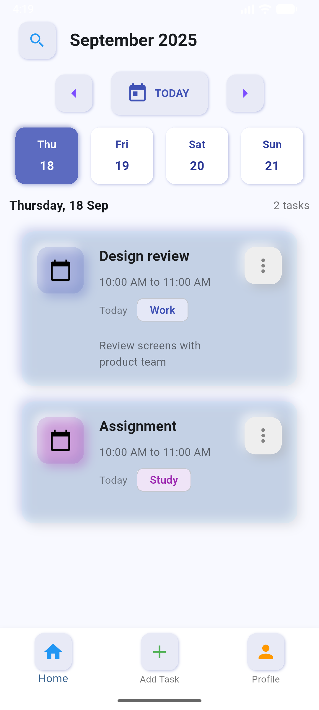
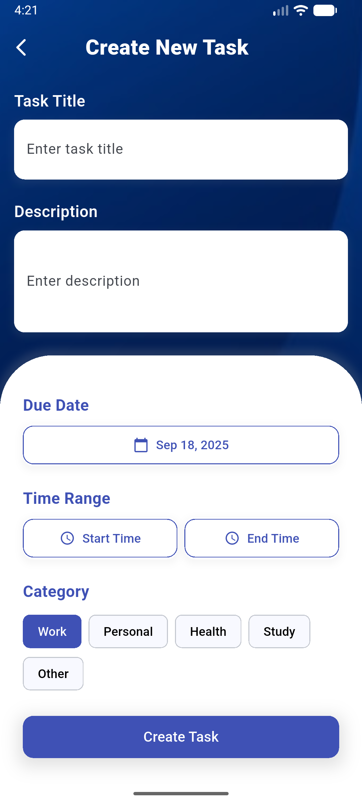

# 📋 Task Management UI – Flutter Code Interview Task

A modern and clean **Task Management Mobile UI** built with Flutter.  
This project was developed as part of a coding assessment, focusing on **UI design, state management, and user experience**.

---

## Features Implemented

### Task List Screen (Home Page)
- Displays **current week (Today + Next 3 days)**.
- Shows **tasks grouped by date**.
- Each task card includes:
    -  **Title**
    -  **Days ago (relative date)**
    -  **Category indicator (colored)**
    -  **Add Task** button.

### Create Task Screen
- Fields included:
    - **Title** (TextField)
    - **Date Picker** (choose task date)
    - **Start Time & End Time** (Time pickers)
    - **Description** (optional text)
    - **Category** (selectable tags: Work, Personal, Study, Health)
    - Validation (end time must be after start time).
    - **Create Task** button → to add task to the list.

---

## 📸 Screenshots

### 🏠 Home (Task List Screen)
  

### ➕ Create Task Screen
  

---

## 🛠️ Tech Stack

- **Flutter** (UI framework)
- **Dart** (Programming language)
- **setState** (State management for simplicity in assessment)

---

## Installation

### Clone the Repository

1. Open your terminal or command prompt.
2. Use the following command to clone the ProjectName repository:
git clone https://github.com/Vishnu-Deepan/Thiran-TaskManagement-UI

### Configuration

1. cd Thiran-TaskManagement-UI
2. flutter pub get
3. flutter run

## 📌 Requirements Mapping

| Requirement                              | Status                                |
|------------------------------------------|---------------------------------------|
| Display current week (Mon–Thu style)     | ✅ Implemented                         |
| Group tasks by date                      | ✅ Implemented                         |
| Task card → Title, Days ago, Icon        | ✅ Implemented                         |
| Floating 'Add Task' button               | ✅ Implemented                         |
| Create Task screen (Title, Date, Time, Desc, Category) | ✅ Implemented            |
| "Create Task" button saves and displays  | ✅ Implemented                         |
| Clean modular code                       | ✅ Done                                |
| State management                         | ✅ setState used                       |
| Good UI/UX                               | ✅ Modern design, category colors      |
| GitHub link with docs                    | ✅ This README                         |

Made by :
- vishnudeepanp@gmail.com

